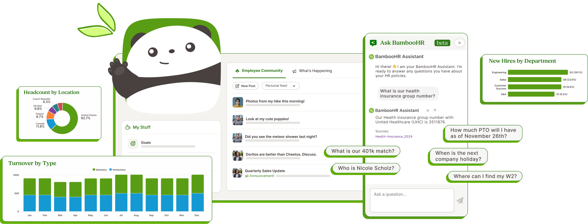

# Hero to HTML

A static HTML/CSS "hero image" built from Figma designs. Multiple UI components (dashboard panels, chat interface, data charts, suggestion pills, SVG illustrations) are composed into a single layered layout using absolute positioning to pixel-match the original Figma composition.

The output behaves like an image -- nothing is interactive, focusable, or selectable.



## Files

| File | Description |
|------|-------------|
| `powerfully-easy-hero.html` | The assembled hero (1155x450 canvas, all components inlined) |
| `hero-responsive-test.html` | Responsive wrapper that scales the hero to fit any viewport width |
| `powerfully-easy-hero-iframes.html` | Archived iframe-based version (backup) |
| `components/` | 10 standalone component HTML files for individual editing |
| `assets/` | SVG files (panda, leaf, chat icons, thumbs) |
| `hero-images/` | Reference PNGs from Figma |
| `my_learnings.md` | Process retrospective and reusable AI prompt |

## Components

- **Desktop UI** -- Employee Community feed + My Stuff panel
- **Mobile UI** -- Ask BambooHR chat interface
- **Headcount by Location** -- Donut chart
- **Turnover by Type** -- Bar chart
- **New Hires by Department** -- Horizontal bar chart
- **Suggestion Pills** (x5) -- Floating question bubbles
- **Panda + Leaf** -- SVG illustrations

## Quick Start

```bash
npm install
npm run dev
```

Opens a live-reloading server at `http://localhost:5174`. View `powerfully-easy-hero.html` for the full composition or `hero-responsive-test.html` for the responsive version.

## How It Was Built

See [my_learnings.md](my_learnings.md) for a full retrospective covering what worked, what didn't, and a reusable prompt for reproducing this workflow with AI assistance.
